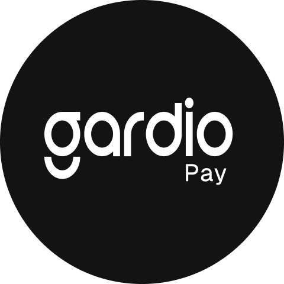
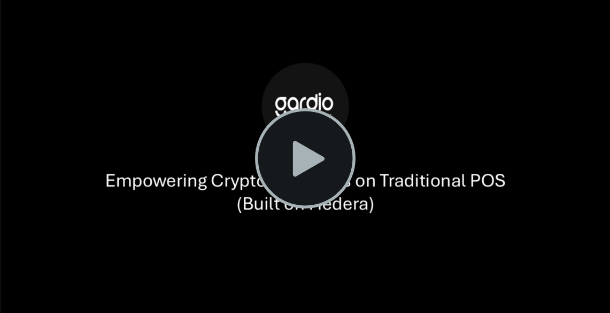

# gardio-pay

  

## Overview

Our mission is to revolutionize payment systems by enabling **seamless native crypto transactions** through the familiar infrastructure of Point of Sale (PoS) terminals — powered by **Gardio EMV Crypto Cards** and the **Hedera network**.

Originally built on **Solana**, Gardio Pay was **adapted and optimized for Hedera** during the hackathon period to leverage its **high speed**, **large transaction capacity**, and **low predictable fees**.

---

## 🎬 Demo

**Watch the demo on Vimeo →** [Gardio Pay Demo](https://vimeo.com/1131850690)

---

## 🧩 Project Description

**Gardio Pay** demonstrates a real-world crypto payment flow using:
- **Gardio EMV Crypto Card** (hardware or simulator) to securely sign transactions.
- **PoS Terminal** at the merchant’s store to process customer payments.
- **Gardio Pay Portal** for users to manage cards, charge balances, and review transaction history.

Because the physical **PoS terminal and card** cannot be shipped to the judges, a **Card + PoS Simulator** was added during the hackathon.  
It reproduces the same interaction shown in the demo, allowing judges to execute real transactions on Hedera using the same logic as the physical hardware.

---

## Components

1. **Portal Frontend Server**  
   Provides the user interface for managing cards, viewing transaction history, and charging accounts.

2. **Gardio SmartCard**  
  A secure hardware card supporting **contact EMV transactions**, with **contactless support currently in progress**, ensuring a seamless user experience.

3. **Gardio-Pay PoS Application**  
   Runs on **Linux-based PoS terminals**, with an **Android version in progress**, enabling merchants to process crypto transactions using Gardio Cards.

4. **Backend Server**  
   Handles communication between the PoS/Card and the blockchain smart contract — including authentication, transaction processing, and account updates.

5. **Smart Contract**  
   Executes the on-chain logic to process EMV transactions, verify card signatures, and update **user and merchant balances** on Hedera.

6. **Gardio Simulator**  
   Simulates **Card and PoS communication** and interacts with the backend server.  
   This allows judges to test the full demo flow (user–merchant interaction) **without requiring physical hardware**.

> 🟡 **Note:** Card provisioning, card registration, terminal provisioning, terminal registration, and merchant registration are **offline steps** performed during the setup phase using **developer tools**, and are **not included in the demo**.

---

## 🧠 Hackathon Updates

During the hackathon period starting on **October 25th**, we accomplished the following major updates:

1. **Hedera Network Support**  
  Migrated from **Solana** and **rewrote the smart contract from Rust to Solidity** for full compatibility with **Hedera**.  
  Updated the **frontend** and **backend** to use **Ethers.js**, **Hedera SDK**, and **MetaMask**, replacing Solana Web3, Solflare, and Phantom wallets.

2. **Card + PoS Simulator**  
   Added a simulator package allowing judges to **test the demo** without requiring the physical card or terminal hardware.

---

## 🔐 Security and Policy

- **Transaction signing** happens inside the card — private keys are never exposed.  
- **Traceable operations** — all transactions can be verified on the Hedera public ledger.  

---

## 📊 Workflow Summary

1. **Merchant Setup (Offline)**  
   Merchant registration and terminal provisioning are handled offline through the PoS terminal setup process.

2. **Card Provisioning (Offline)**  
   Cards are securely issued and linked to user accounts before activation and use.

3. **Payment (Demo Flow)**  
   - The user **charges/adds balance** to the card from the **Gardio Pay Portal**.  
   - The user then interacts with the **PoS terminal** (as shown in the demo).  
   - The **Gardio Card** securely signs the transaction and sends it to the **Hedera network**.  
   - Transaction confirmation appears instantly on both the **terminal** and the **portal**, and the **merchant’s wallet** is updated within a few seconds.

4. **Portal Management**  
   Users can access the **Gardio Pay Portal** to view balances, charge funds, or review transaction history at any time.

---

## 💡 Upcoming Features (TODO)

### 1. **Prepaid & Debit Cards**
In the current demo, Gardio Pay showcases **prepaid cards**, which are linked to **managed accounts** and can be charged through the **portal** or any **external wallet that supports Hedera USDC**.  
A new feature under development introduces **debit cards**, allowing users to **link their card directly to their own USDC account address** on Hedera.  
This provides greater flexibility and control while maintaining the same high level of backend security.  
In essence, the **same card** can operate as either **prepaid or debit**, with the ability to **switch or update the linked account** at any time.

### 2. **Card Revocation**
- **Debit Cards:** Users will be able to lock their card instantly if lost or compromised.  
- **Prepaid Cards:** When revoked, the card is locked and the associated address is frozen, preventing any further transactions.

### 3. **Mobile Access**
While the portal is mobile-friendly (allowing users to manage cards, view history, and charge via QR or address), a **dedicated mobile app** is currently in development to enhance the user experience.

---

## Comparative Overview
Gardio Pay enables:
- **Native crypto** payments  
- **Instant settlement**  
- **Fixed, predictable fees**  
- **Inherent security** from both **Hedera** and **Secure Element–based SmartCards**  
- **User experience** identical to traditional cards and PoS terminals

---

## 🔗 Links
- Contact: **info@gardio.io**  
- Hackathon Submission: [Hedera Africa Hackathon](https://dorahacks.io/buidl/35550)

---

## 📜 Source Code Access

The Gardio Pay source code can be **shared under NDA** for technical or evaluation purposes.  
Please contact **info@gardio.io** to request access.

> The User Guide, which includes the Gardio Pay Portal link, Gardio Simulator link, and demo credentials, was submitted via a Box link during the hackathon submission.
---

## 🏷️ Tags / Topics
`gardio`, `gardio pay`, `Hedera`, `Solana`, `Crypto`, `USDC`, `Payment`, `Gardio Card`, `Blockchain`, `Hackathon`, `Demo`

---

© 2025 Gardio
